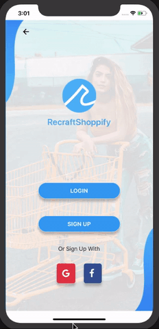

[<p align="center"></p>](https://github.com/recraftrelic/recraft-react-native-shopping-app/)

<h1 align="center">Recraft React Native Base App Seed</h1>

<p align="center">This base app is a boilerplate for any react native developer who wants to build a simple app.</p>

<p align="center">The goal of this boilerplate is to provide a simple functional routing & theme app which can be reused with very little to no modification.</p>

Demo
=======
<p align="center">
  
</p>

Packages & Libraries used
=======

* [React Native](https://www.npmjs.com/package/react-native)
* [React](https://www.npmjs.com/package/react)
* [React router native](https://www.npmjs.com/package/react-router-native)
* [TypeScript](https://www.npmjs.com/package/typescript)

Steps to Run the Project in Development Mode
=======
Use the below commands to clone the project and enter inside the directory
After that install the dependencies.
```
git clone git@github.com:recraftrelic/recraft-react-native-base-app-seed.git
cd recraft-react-native-base-app-seed.git
yarn install
```

### IOS
We can directly run the app
```
npx react-native run-ios
```

### Facing any error related to pods in ios
We need to install the pods
```
sudo gem install cocoapods
cd ios
pod install
cd ..
npx react-native run-ios
```

### Android
We can directly run the app
```
npx react-native run-android
```

Contributors
=======
* [manojsinghnegiwd](https://github.com/manojsinghnegiwd) - Manoj Singh Negi
* [puranchand](https://github.com/puranchand) - Puran Chand
* [yashkapoor8710](https://github.com/yashkapoor8710) - Yogesh Kapoor

Sponsors
=======
[](http://www.recraftrelic.com)