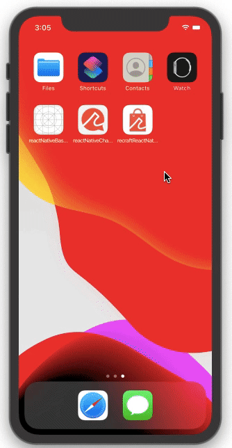
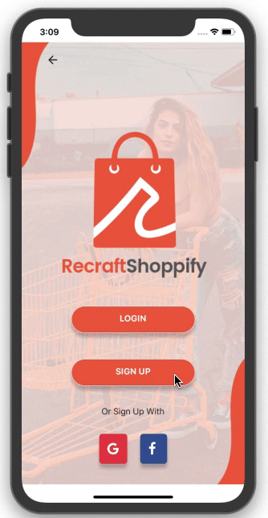
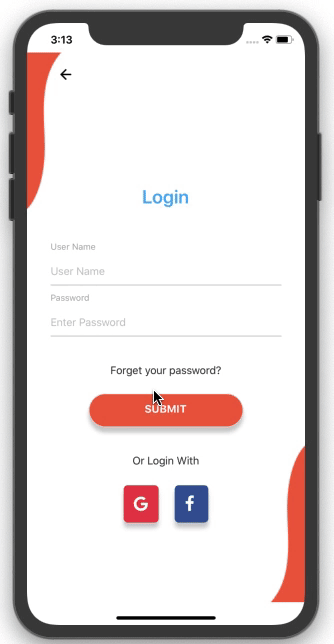
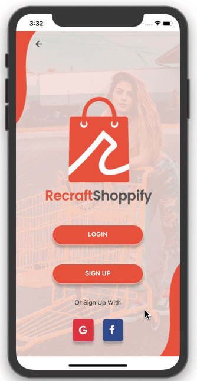
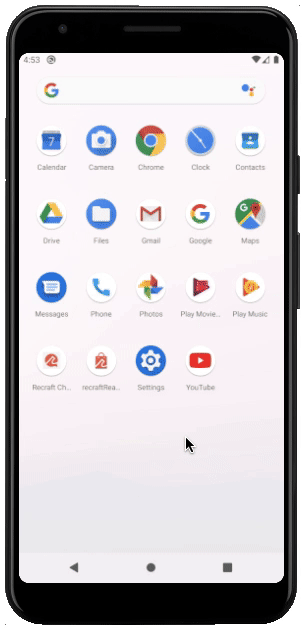
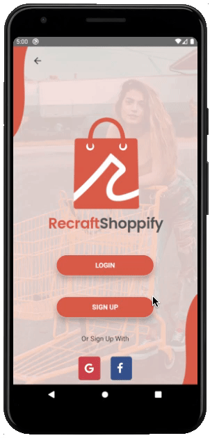
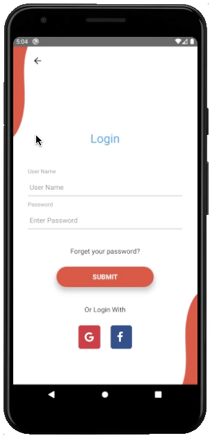
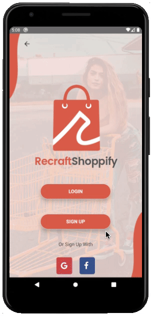
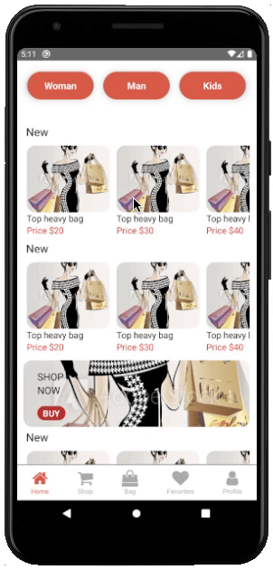
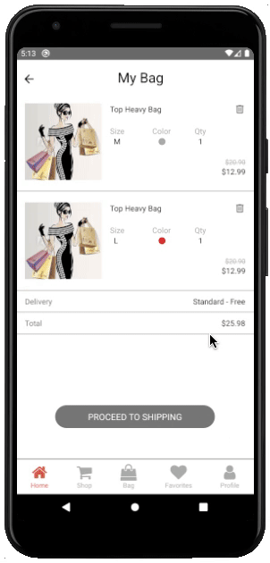

[<p align="center"></p>](https://github.com/recraftrelic/recraft-react-native-shopping-app/)

<h1 align="center">Recraft React Native Shopping App</h1>

<p align="center">This shopping app is a boilerplate for any react native developer who wants to build a shopping app. The goal of this boilerplate is to provide a fully functional shopping app which can be reused with very little to no modification.</p>

Note
=======

> You can also get the app on play store 

IOS Demo
=======
<p align="center">
  
</p>
<p align="center">
  
</p>

Android Demo
=======
<p align="center">
  
</p>
<p align="center">
  
</p>

Packages & Libraries used
=======

* [React Native](https://www.npmjs.com/package/react-native) - A framework for building native apps with React.
* [React](https://www.npmjs.com/package/react) - A declarative, efficient, and flexible JavaScript library for building user interfaces.
* [React router native](https://www.npmjs.com/package/react-router-native) - Declarative routing for React.
* [TypeScript](https://www.npmjs.com/package/typescript) - TypeScript is a superset of JavaScript that compiles to clean JavaScript output.
* [React native carousel](https://www.npmjs.com/package/react-native-carousel) - A simple swipeable carousel for React Native
* [React native modal](https://www.npmjs.com/package/react-native-modal) - An enhanced, animated and customizable react-native modal.
* [React native vector icons](https://www.npmjs.com/package/react-native-vector-icons) - Customizable Icons for React Native with support for NavBar/TabBar/ToolbarAndroid, image source and full styling.
* [React native splash screen](https://www.npmjs.com/package/react-native-splash-screen) - A splash screen API for react-native which can programatically hide and show the splash screen.

Steps to Run the Project in Development Mode
=======
Use the below commands to clone the project and enter inside the directory
After that install the dependencies.
```
git clone git@github.com:recraftrelic/recraft-react-native-base-app-seed.git
cd recraft-react-native-base-app-seed.git
yarn install
```

### IOS
We can directly run the app
```
npx react-native run-ios
```

### Facing any error related to pods in ios
We need to install the pods
```
sudo gem install cocoapods
cd ios
pod install
cd ..
npx react-native run-ios
```

### Android
We can directly run the app
```
npx react-native run-android
```

Note
=======

> Once you clone and if you want to change the name of the application you can follow this article https://medium.com/the-react-native-log/how-to-rename-a-react-native-app-dafd92161c35

Roadmap
=======

* Move all the lists to constants
* Deploy to playstore
* Implement internationalization
* Improve documentation

Contributors
=======
* [manojsinghnegiwd](https://github.com/manojsinghnegiwd) - Manoj Singh Negi
* [puranchand](https://github.com/puranchand) - Puran Chand
* [yashkapoor8710](https://github.com/yashkapoor8710) - Yogesh Kapoor

Sponsors
=======
[](http://www.recraftrelic.com)